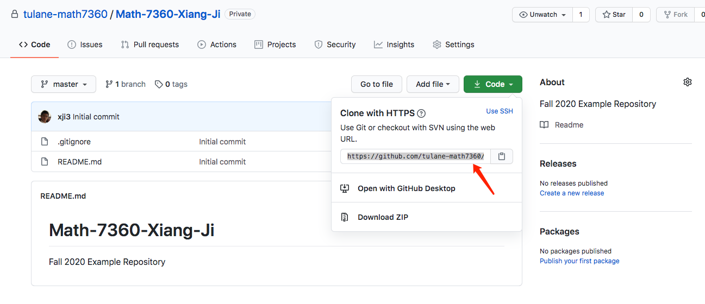
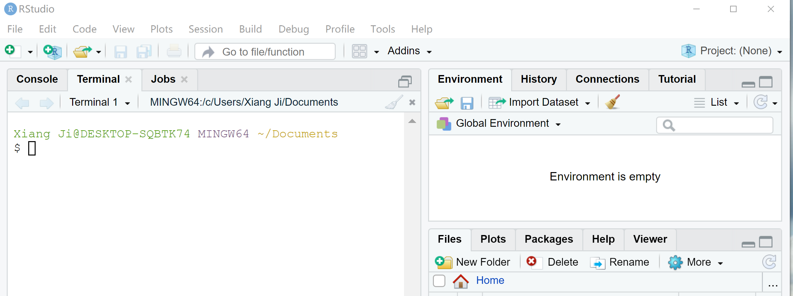

## Some Git exercise

1. create a git repository in our [course organization](https://github.com/tulane-math7360), you may follow [this tutorial](https://docs.github.com/en/github/getting-started-with-github/create-a-repo).
   
   - Remember to go to the [course organization page](https://github.com/tulane-math7360) and click on the "New" button to create the repository.

<p align="center">
  
</p>
   
   - Please name your repository with the format "Math-7360-FirstName-LastName".  For example, I created a repository with name "Math-7360-Xiang-Ji".
   
   - Leave a description that you like, make sure to state "Fall 2020" in your description.  You will use this repository for submitting all of your homework assignments.
   
   - Make the repository private.
   
   - (Optional) You could add a README file.  You could also add ".gitignore" file.  A good choice here is "R" so that the .gitignore template for R will be loaded.
   If you want, you may also choose a license (you don't need to worry for license until making the repository public).
   
   - You should see your new repository in our [course organization page](https://github.com/tulane-math7360) now.  If this is your first git repository, then congratulations!

2. Now let's create a local copy of your repository.

   1. Enter your repository on GitHub by clicking on it (Don't click on my repository...).
<p align="center">
  
</p>

   2. Now get your git repository address by clicking on "Code" button then copy the url.
<p align="center">
  
</p>

   3. Open locate the "Terminal" tab in your RStudio app.
      
      - For Mac/Linux users, you may open the "terminal" that ships with the Operating System for this.
      
      - For Windows users, you should see something similar to the figure below.  If your "terminal" failed on initiation, try "New Terminal" (hotkey combination: Alt+Shift+R).  This creates a Linux shell (so that it uses the same commands as in a Linux command-line environment) on Windows for you.
<p align="center">
  
</p>


   4. In the terminal window, navigate to a location that you want to store your GitHub repository that you just created.
   Then `git clone {the_url_you_just_copied_in_step_2}`.
   For example, I use `git clone https://github.com/tulane-math7360/Math-7360-Xiang-Ji.git` for my repository.
   
If you are not familiar with shell environment,
you could start with finding where you are by type command `pwd` in the terminal window.
You can also open the graphic file system by type `open .` in the terminal.
If you want to change to another location, try to play with terminal using commands from the following list.  Tip: `cd`
  
  **Some useful commands to get you started.**
  
  - `pwd` print absolute path to the current working directory (where you are right now) 
  
  - `ls` list contents of a directory 
  
  - `ls -l` list detailed contents of a directory 
  
  - `ls -al` list all contents of a directory, including those start with `.` (hidden files/folders) 
  
  - `cd` change directory 
  
  - `cd ..` go to the parent directory of the current working directory
  
  
**Manipulate files and directories**
  
  - `cp` copies file to a new location.
  
  - `mv` moves file to a new location.
  
  - `touch` creates a text file; if file already exists, it's left unchanged.
  
  - `rm` deletes a file.
  
  - `mkdir` creates a new directory.
  
  - `rmdir` deletes an _empty_ directory.
  
  - `rm -rf` deletes a directory and all contents in that directory (be cautious using the `-f` option ...).


<!-- 3. Now let's finish your first git training by pushing your first commit.  We will discuss Git on next Wednesday class. -->

<!--    1. In the terminal window, change directory to your git repository by `cd Math-7360-FirstName-LastName`. -->

<!--    2. Edit the README.md file.  You can do this by open the file with the text editing software `nano` with command `nano README.md` -->

## Some exercise on R functions

```{r}
rm(list = ls()) # clean up workspace first
```

### [Case study on numerical integration](http://adv-r.had.co.nz/Functional-programming.html#numerical-integration) (link to the solutions).

We will implement two simplest approaches for numerical integration and apply them to integrate `sin(x)` from $0$ to $\pi$.

1. Finish the code that calculates `midpoint` and `trapezoid` values.

$\mbox{midpoint} = (b - a) \times f(\frac{a + b}{2})$

$\mbox{trapezoid} = \frac{b - a}{2} \times (f(a) + f(b))$

```{r, eval = FALSE}
# if you are modifying this source file directly, remember to change the above flag to eval=TRUE
# finish the code below
midpoint <- function(f, a, b) {
  result <- 
  return(result)
}

trapezoid <- function(f, a, b) {
  result <-
  return(result)
}

# what do you get?
midpoint(sin, 0, pi)
trapezoid(sin, 0, pi)
```

2. Implement **composite integration** of the above two methods.

```{r, eval = FALSE}
midpoint.composite <- function(f, a, b, n = 10) {
  points <- seq(a, b, length = n + 1)

  area <- 0
  for (i in seq_len(n)) {
    area <- area + midpoint()
  }
  return(area)
}

trapezoid.composite <- function(f, a, b, n = 10) {
  points <- seq(a, b, length = n + 1)
  
  area <- 0
  for (i in seq_len(n)) {
    area <- area + trapezoid()
  }
  return(area)
}

midpoint.composite(sin, 0, pi, n = 10)

midpoint.composite(sin, 0, pi, n = 100)

midpoint.composite(sin, 0, pi, n = 1000)

trapezoid.composite(sin, 0, pi, n = 10)

trapezoid.composite(sin, 0, pi, n = 100)

trapezoid.composite(sin, 0, pi, n = 1000)
```

Now try the above functions with `n=10, 100, 1000`.  Explain your findings.

3. (not in the above solutions, will be provided after Monday) Well, the above functions have loop! Let's try to avoid loops.

```{r, eval = FALSE}
midpoint.composite.vectorize <- function(f, a, b, n = 10) {
  points <- seq(a, b, length = n + 1)
  areas <- midpoint(f, points[], points[])  # Tip: the first points[] should be the list of all a's and the second points[] should be the list of all b's
  return(sum(areas))
}

trapezoid.composite.vectorize <- function(f, a, b, n = 10) {
  points <- seq(a, b, length = n + 1)
  areas <- trapezoid(f, points[], points[])
  return(sum(areas))
}

midpoint.composite.vectorize(sin, 0, pi, n = 10)

midpoint.composite.vectorize(sin, 0, pi, n = 100)

midpoint.composite.vectorize(sin, 0, pi, n = 1000)

trapezoid.composite.vectorize(sin, 0, pi, n = 10)

trapezoid.composite.vectorize(sin, 0, pi, n = 100)

trapezoid.composite.vectorize(sin, 0, pi, n = 1000)
```

Now try the above vectorized functions with `n=10, 100, 1000`.  Explain your findings.

4. compare run time (The text will make sense after running the code)

From [William Dunlap](http://r.789695.n4.nabble.com/Meaning-of-proc-time-td2303263.html#a2306691):

> "User CPU time" gives the CPU time spent by the current 
process (i.e., the current R session) and "system CPU time" 
gives the CPU time spent by the kernel (the operating 
system) on behalf of the current process.  The operating 
system is used for things like opening files, doing 
input or output, starting other processes, and looking at 
the system clock:  operations that involve resources that many 
processes must share.  Different operating systems will 
have different things done by the operating system.

```{r, eval = FALSE}
system.time(midpoint.composite(sin, 0, pi, n = 10000))
system.time(trapezoid.composite(sin, 0, pi, n = 10000))
system.time(midpoint.composite.vectorize(sin, 0, pi, n = 10000))
system.time(trapezoid.composite.vectorize(sin, 0, pi, n = 10000))
```


### Normal equations

Now let's implement the Normal equations from scratch.
$\hat{\beta} = (X^{\top}X)^{-1}X^{\top}Y$.

```{r, eval = FALSE}
my.normal.equations <- function(X, Y) {
  if (!is.vector(Y)) {
    stop("Y is not a vector!")
  }
  
  if (!is.matrix(X)) {  # force X to be a matrix for now
    stop("X is not a matrix!")
  }
  
  if (dim(X)[1] != length(Y)) {
    stop("Dimension mismatch between X and Y!")
  }
  
  return() # finish the calculation for beta
}

set.seed(7360)
sample.size <- 100
num.col <- 2
X <- matrix(rnorm(sample.size * num.col), nrow = sample.size, ncol = num.col)
X <- cbind(1, X)
Y <- rnorm(sample.size)

system.time(result.lm <- lm(Y ~ X[, 2] + X[, 3]))
summary(result.lm)

system.time(result.my.normal.equations <- my.normal.equations(X, Y))
result.my.normal.equations

```

Does your result match the estimated coefficients from the `lm()` function?
